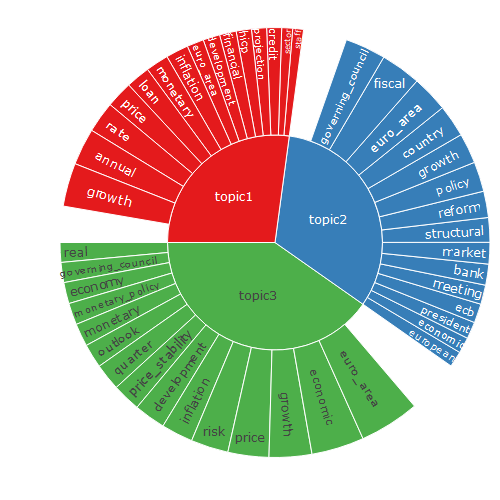
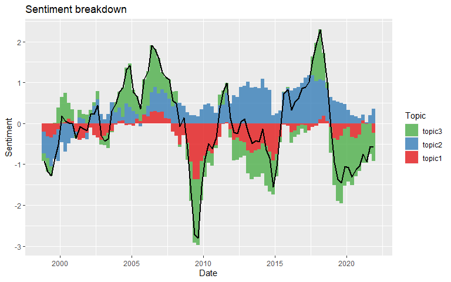

<!-- README.md is generated from README.Rmd. Please edit that file -->

# sentopics

<!-- badges: start -->

[](https://github.com/odelmarcelle/sentopics/actions)
[](https://app.codecov.io/gh/odelmarcelle/sentopics)
<!-- badges: end -->

## Installation

`sentopics` is currently installable from GitHub.

``` r
devtools::install_github("odelmarcelle/sentopics") 
```

## Basic usage

Using a sample of press conferences from the European Central Bank, an
LDA model is easily created from a list of tokenized texts. See
<https://quanteda.io> for details on `tokens` input objects and
pre-processing functions.

``` r
library(sentopics)
print(ECB_press_conferences_tokens, 2)
# Tokens consisting of 3,860 documents and 5 docvars.
# 1_1 :
#  [1] "outcome"           "meeting"           "decision"         
#  [4] ""                  "ecb"               "general"          
#  [7] "council"           "governing_council" "executive"        
# [10] "board"             "accordance"        "escb"             
# [ ... and 7 more ]
# 
# 1_2 :
#  [1] ""              "state"         "government"    "member"       
#  [5] "executive"     "board"         "ecb"           "president"    
#  [9] "vice"          "president"     "date"          "establishment"
# [ ... and 13 more ]
# 
# [ reached max_ndoc ... 3,858 more documents ]
set.seed(123)
lda <- LDA(ECB_press_conferences_tokens, K = 4)
lda <- grow(lda, 100)
lda
# An LDA model with 4 topics. Currently grown by 100 Gibbs sampling iterations.
# ------------------Useful methods------------------
# grow      :Iterates the model using Gibbs sampling
# topics    :Return the most important topic of each document
# topWords  :Return a data.table with the top words of each topic/sentiment
# plot      :A sunburst chart representing the estimated mixtures
# This helpful message is displayed once per session, unless calling `print(x, extended = TRUE)`
```

There are various way to extract results from the model: it is either
possible to directly access the estimated mixtures from the `lda` object
or to use some helper functions.

``` r
# The document-topic distributions
head(lda$theta) 
#       topic
# doc_id     topic1    topic2     topic3     topic4
#    1_1 0.04761905 0.8095238 0.04761905 0.09523810
#    1_2 0.03703704 0.8888889 0.03703704 0.03703704
#    1_3 0.10000000 0.7000000 0.10000000 0.10000000
#    1_4 0.42857143 0.4285714 0.07142857 0.07142857
#    1_5 0.06666667 0.7333333 0.13333333 0.06666667
#    1_6 0.11111111 0.6666667 0.11111111 0.11111111
# The document-topic in a 'long' format & optionally with meta-data
head(melt(lda, include_docvars = FALSE))
#     topic .id       prob
# 1: topic1 1_1 0.04761905
# 2: topic1 1_2 0.03703704
# 3: topic1 1_3 0.10000000
# 4: topic1 1_4 0.42857143
# 5: topic1 1_5 0.06666667
# 6: topic1 1_6 0.11111111
# The most probable words per topic
topWords(lda, output = "matrix") 
#       topic1            topic2              topic3           
#  [1,] "price"           "fiscal"            "monetary"       
#  [2,] "inflation"       "governing_council" "growth"         
#  [3,] "development"     "country"           "rate"           
#  [4,] "pressure"        "policy"            "loan"           
#  [5,] "inflation_rate"  "euro_area"         "financial"      
#  [6,] "annual"          "reform"            "interest_rate"  
#  [7,] "increase"        "structural"        "credit"         
#  [8,] "projection"      "growth"            "annual"         
#  [9,] "price_stability" "meeting"           "monetary_policy"
# [10,] "hicp"            "market"            "bank"           
#       topic4             
#  [1,] "euro_area"        
#  [2,] "growth"           
#  [3,] "economic"         
#  [4,] "risk"             
#  [5,] "quarter"          
#  [6,] "real"             
#  [7,] "economy"          
#  [8,] "market"           
#  [9,] "economic_activity"
# [10,] "recovery"
```

Two visualization are also implemented: `plot_topWords()` display the
most probable words and `plot()` summarize the topic proportions and
their top words.

``` r
plot(lda)
```



After properly incorporating date and sentiment medata data (if they are
not already present in the `tokens` input), time series functions allows
to study the evolution of topic proportions and related sentiment.

``` r
sentopics_date(lda)  |> head(2)
#    .id      .date
# 1: 1_1 1998-06-09
# 2: 1_2 1998-06-09
sentopics_sentiment(lda) |> head(2)
#    .id  .sentiment
# 1: 1_1 -0.01470588
# 2: 1_2 -0.02500000
proportion_topics(lda, period = "month") |> head(2)
#               topic1    topic2    topic3    topic4
# 1998-06-01 0.1233053 0.6463265 0.1139985 0.1163698
# 1998-07-01 0.1262036 0.4980435 0.2047400 0.1710129
plot_sentiment_breakdown(lda, period = "quarter", rolling_window = 3)
```



## Advanced usage

Feel free to refer to the vignettes of the package for a more extensive
introduction to the features of the package. Because the package is not
yet on CRAN, you’ll have to build the vignettes locally.

``` r
devtools::install_github("odelmarcelle/sentopics", build_vignettes = TRUE)
vignette(package = "sentopics")
```
